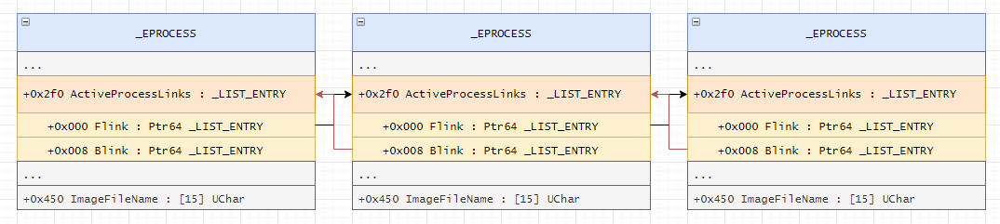
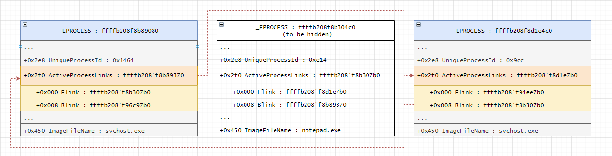

# Rootkit
The Rootkit is a kernel mode Rootkit that hides all the processes that their name starts with $ROOT$

The Rootkit iterates all the processes by the LIST_ENTRY structure.
The LIST_ENTRY structure has two members Flink (Forward Process) and Blink (Backward Process), both of them (Flink , Blink) are LIST_ENTRY structure.
The image below can demonstrate that:

And the rootkit sets his LIST_ENTRY.Blink.Flink to LIST_ENTRY.Flink.
Also he sets his LIST_ENTRY.Flink.Blink to LIST_ENTRY.Blink.Flink.
Like you can see in the image below:

